<div align="center">

# 🪢 LOOM
### Unified Agentic Coding Harness

**Verification-first autonomous software engineering infrastructure.**  
*5-Stage DAG Pipeline • AST Proximity Indexing • gVisor Sandbox Isolation • Tamper-Evident SHA-256 Evidence Chains*

<br/>

[](https://www.python.org/)
[](https://nextjs.org/)
[](https://fastapi.tiangolo.com/)
[](https://github.com/Harshid001/Loom-Unified-Agentic-Coding-Harness)
[](LICENSE)

<br/>

```text
┌─────────────────────────────────────────────────────────────────────────────────────────────┐
│                                                                                             │
│  [TASK] ➔ [01 MAPPER] ➔ [02 REPRO] ➔ [03 PLANNER] ➔ [04 PATCHER] ➔ [05 VERIFIER] ➔ [PROOF]   │
│              AST Graph       Red Test      Surgical Spec    Unified Diff     Green Sandbox  │
│                                                                                             │
└─────────────────────────────────────────────────────────────────────────────────────────────┘
```

> **The Core Invariant:** *An agent cannot declare an issue resolved without cryptographic proof and sandbox test verification.*

</div>

---

## 📑 Table of Contents

- [💡 Why Loom?](#-why-loom)
- [⚡ Quickstart in 60 Seconds](#-quickstart-in-60-seconds)
- [🔄 The 5-Stage Agentic DAG Pipeline](#-the-5-stage-agentic-dag-pipeline)
- [🏛️ Architectural System Overview](#️-architectural-system-overview)
- [🛡️ Key Capabilities & Security Pillars](#️-key-capabilities--security-pillars)
  - [1. Verification-First Proof Engine](#1-verification-first-proof-engine)
  - [2. Tamper-Evident SHA-256 Evidence Bundles](#2-tamper-evident-sha-256-evidence-bundles)
  - [3. Repository Intelligence & AST Context Ranking](#3-repository-intelligence--ast-context-ranking)
  - [4. Multi-Tier Sandbox Isolation](#4-multi-tier-sandbox-isolation)
  - [5. Snapshot Rollback & Post-Merge Healing](#5-snapshot-rollback--post-merge-healing)
  - [6. Model-Independent Router & Cost Attribution](#6-model-independent-router--cost-attribution)
- [💻 Interfaces: Web Dashboard, CLI & TUI](#-interfaces-web-dashboard-cli--tui)
- [🛠️ CLI Command Reference](#️-cli-command-reference)
- [🔒 Security & Credential Isolation Model](#-security--credential-isolation-model)
- [🧪 Quality Gates & Test Suite](#-quality-gates--test-suite)
- [📁 Project Directory Structure](#-project-directory-structure)
- [📄 License](#-license)

---

## 💡 Why Loom?

Traditional coding assistants optimize for generating **plausible patches**. In real codebases, plausible patches introduce subtle regressions, hallucinated APIs, and security vulnerabilities.

Loom solves the harder problem: **autonomous software repair with end-to-end mathematical and empirical verification**.

```mermaid
flowchart LR
    A[📝 Issue / Task] --> B[🌳 AST Repo Mapping]
    B --> C[🔴 Red-Phase Repro Test]
    C --> D[📐 Surgical Implementation Plan]
    D --> E[🩹 Minimal Unified Patch]
    E --> F[🟢 Green-Phase Sandbox Verification]
    F --> G[📜 SHA-256 Evidence Chain Seal]
    G --> H[🚀 Auto-Merge or Human Review]
    
    style A fill:#1e1e2e,stroke:#cba6f7,stroke-width:2px,color:#cdd6f4
    style B fill:#1e1e2e,stroke:#89b4fa,stroke-width:2px,color:#cdd6f4
    style C fill:#1e1e2e,stroke:#f38ba8,stroke-width:2px,color:#cdd6f4
    style D fill:#1e1e2e,stroke:#fab387,stroke-width:2px,color:#cdd6f4
    style E fill:#1e1e2e,stroke:#f9e2af,stroke-width:2px,color:#cdd6f4
    style F fill:#1e1e2e,stroke:#a6e3a1,stroke-width:2px,color:#cdd6f4
    style G fill:#1e1e2e,stroke:#94e2d5,stroke-width:2px,color:#cdd6f4
    style H fill:#1e1e2e,stroke:#b4befe,stroke-width:2px,color:#cdd6f4
```



| Problem in Naive LLM Coding | Loom's Architectural Solution |
|---|---|
| ❌ Claims the bug is fixed without running tests | ✅ **Red-to-Green Test Cycle**: Synthesizes a failing test first, then proves it passes post-patch |
| ❌ Hallucinates files and edits unrelated code | ✅ **Tree-Sitter AST & Call Graph Proximity**: Indexes exact symbol dependency subtrees |
| ❌ Unchecked execution damages host filesystem | ✅ **Fail-Closed Sandboxes**: Tier A (Worktree) & Tier B (gVisor/Docker) with strict egress deny firewalls |
| ❌ Blind trust with zero accountability | ✅ **Tamper-Evident SHA-256 Evidence Chains**: Hash-linked audit bundles tracking exact diffs & logs |
| ❌ Broken PRs require manual git untangling | ✅ **One-Click Pre-Patch Snapshots**: Instant rollback via reverse AST hunks & snapshot IDs |

---

## ⚡ Quickstart in 60 Seconds

### 1. Installation

```bash
# Clone repository
git clone https://github.com/Harshid001/Loom-Unified-Agentic-Coding-Harness.git
cd Loom-Unified-Agentic-Coding-Harness

# Install Python backend (Editable mode with dev dependencies)
pip install -e ".[dev]"

# Configure environment
cp .env.example .env
```

### 2. Run Autonomous Repair via CLI

```bash
# Solve an issue in any local repository with a single command
loom fix "Fix IndexError when token budget is exceeded in ContextBudgetManager" --model claude-3-7-sonnet
```

### 3. Launch the Control Plane (Web Dashboard + Backend)

```bash
# Terminal 1: Start FastAPI Control Plane Server
loom server --port 8000

# Terminal 2: Start Next.js Web Dashboard
cd web
npm install
npm run dev
```

Open **`http://localhost:3000`** in your browser to access the control workstation.

---

## 🔄 The 5-Stage Agentic DAG Pipeline

Loom executes tasks through an acyclic state machine driven by strict preconditions:

```text
[01 MAPPER] ─────────► [02 REPRO] ─────────► [03 PLANNER] ─────────► [04 PATCHER] ─────────► [05 VERIFIER] ─────────► [06 REVIEWER]
 Tree-Sitter AST       Synthesize Failing    Rank Context Budget     Generate Unified        Execute Isolated        Construct SHA-256
 Call Graph Index      Red-Phase Test        & Surgical Strategy     Code Modification       Pytest Suite (Green)    Proof & Summary
```

### Detailed Breakdown of Each Specialist Agent:

1. **`OnboardingAgent` (Mapper)**:
   - Parses repository source code with Tree-Sitter across Python & TypeScript.
   - Builds symbol dependency indices, call graphs, and historical git commit proximity maps.
   - *Precondition:* Must output a validated `repo_map` before downstream agents activate.

2. **`ReproductionAgent` (Repro)**:
   - Analyzes issue descriptions and generates a deterministic, isolated reproduction script.
   - Executes in the sandbox to guarantee the test **fails on the unpatched codebase** (Red Phase).

3. **`PlannerAgent` (Planner)**:
   - Evaluates reproduction trace outputs and calculates token budgets using TF-IDF and AST proximity.
   - Produces a bounded implementation plan detailing target functions, files, and invariants.

4. **`PatcherAgent` (Patcher)**:
   - Synthesizes surgical unified diffs touching only the relevant AST subtrees.
   - Validates syntax trees and sanitizes against prompt injections and disallowed path traversals.

5. **`VerifierAgent` (Verifier)**:
   - Mounts the patch inside an isolated sandbox (Tier A Worktree or Tier B Container).
   - Executes the reproduction test + entire regression suite. Proves all tests pass (Green Phase) with **0 regressions**.

6. **`ReviewerAgent` (Reviewer)**:
   - Synthesizes a human-readable **Resolution Summary Brief** (Root Cause Diagnosis, Surgical Modification, Verification Proof).
   - Hashes all artifact payloads and seals the run into an immutable, hash-chained evidence bundle.

---

## 🏛️ Architectural System Overview

```text
                               ┌─────────────────────────────────────────┐
                               │   Next.js 16 Web UI / Terminal TUI / CLI │
                               └────────────────────┬────────────────────┘
                                                    │
                                                    ▼
                               ┌─────────────────────────────────────────┐
                               │       FastAPI Control Plane Server       │
                               │  Auth • RBAC • SCIM • Rate Limiter • SDK│
                               └────────────────────┬────────────────────┘
                                                    │
                                                    ▼
                               ┌─────────────────────────────────────────┐
                               │         DAG TaskGraph Orchestrator      │
                               │     Fail-Closed State Machine Engine    │
                               └─────────┬───────────────────┬───────────┘
                                         │                   │
                     ┌───────────────────┴───┐           ┌───┴───────────────────┐
                     ▼                       ▼           ▼                       ▼
              ┌──────────────┐       ┌───────────────┐ ┌───────────────┐ ┌───────────────┐
              │ Repo Intel   │       │ Model Router  │ │ 7-Tier Memory │ │ Telemetry &   │
              │ Tree-Sitter  │       │ LiteLLM Cascade│ │ Vector Store  │ │ Cost Ledger   │
              └──────┬───────┘       └───────┬───────┘ └───────┬───────┘ └───────┬───────┘
                     │                       │                 │                 │
                     └───────────────────────┼─────────────────┴─────────────────┘
                                             │
                                             ▼
                               ┌───────────────────────────┐
                               │     Sandbox Subsystem     │
                               │ Tier A: Worktree Snapshot │
                               │ Tier B: Docker / gVisor   │
                               │ Tier C: MicroVM Enclave   │
                               └─────────────┬─────────────┘
                                             │
                                             ▼
                               ┌───────────────────────────┐
                               │ Evidence Bundler & Proof  │
                               │ SHA-256 Chained Manifests │
                               └───────────────────────────┘
```

---

## 🛡️ Key Capabilities & Security Pillars

### 1. Verification-First Proof Engine
Loom completely rejects unverified model claims. Every run executes a 4-point verification checklist:
- **Patch Syntax & Linting:** Formatted, valid AST modifications.
- **Red-Phase Reproduction:** Validated failing test confirming the issue exists.
- **Green-Phase Sandbox Pytest:** Full regression suite passes with 0 failures.
- **Confidence-Score Matrix:** Auto-merge threshold (minimum 0.85 floor) enforcing human review on high-risk diffs.

### 2. Tamper-Evident SHA-256 Evidence Bundles
Every execution produces a cryptographically sealed receipt governed by [`EvidenceBundler`](loom/verification/bundle.py):
$$\text{ChainHash}_i = \text{SHA-256}(\text{Index}_i \parallel \text{PayloadHash}_i \parallel \text{ChainHash}_{i-1})$$
- Payload hashes are computed directly over actual UTF-8 artifact bytes (diffs, test code, execution logs).
- The web frontend utilizes the standard browser **Web Crypto API** (`crypto.subtle.digest('SHA-256', ...)`) to dynamically verify receipts against backend seals.

### 3. Repository Intelligence & AST Context Ranking
Instead of dumping entire codebases into LLM context windows, Loom extracts precision context:
- **Tree-Sitter AST Indexing:** Symbol extraction for classes, functions, and call hierarchies.
- **Context Budget Manager:** Ranks files using TF-IDF keyword density, graph distance from the bug, and error traces.
- **Prompt Sanitizer:** Treats repository content as untrusted input, neutralizing prompt-injection attempts.

### 4. Multi-Tier Sandbox Isolation
- **Tier A (Git Worktree):** Ephemeral local worktrees for fast, non-destructive patch application.
- **Tier B (Container / gVisor):** Isolated container execution with strict `DENY_ALL` egress firewall policies.
- **Tier C (MicroVM Architecture):** Hardware-isolated virtual machines for adversarial multi-tenant execution.
- **Fail-Closed Boundary:** If the designated sandbox tier is unreachable, execution halts immediately rather than silently downgrading to the host.

### 5. Snapshot Rollback & Post-Merge Healing
- Pre-execution snapshots are created automatically prior to any filesystem modification.
- Reversible unified diffs allow instantaneous rollback via `loom rollback <run_id>`.
- Automated CI webhook monitoring triggers instant rollbacks if post-merge failures are detected.

### 6. Model-Independent Router & Cost Attribution
- Integrates with Anthropic (Claude 3.7 Sonnet), OpenAI (GPT-4o), Google (Gemini 1.5 Pro), and DeepSeek via LiteLLM.
- Model fallback cascades dynamically route tasks based on latency, complexity, and quota headroom.
- Per-step token and inference cost attribution is recorded to an append-only ledger.

---

## 💻 Interfaces: Web Dashboard, CLI & TUI

### 1. Next.js 16 Web Workstation (`web/`)
A responsive control plane providing:
- Real-time SSE streaming DAG execution workstation.
- Interactive 5-stage pipeline visualizer.
- Syntax-highlighted unified diff inspector.
- Web Crypto SHA-256 Evidence Bundle exporter.
- Ephemeral in-memory GitHub PAT integration.

```bash
cd web && npm run dev
```

### 2. Interactive Terminal UI (`loom tui`)
Rich, terminal-native dashboard built with Textual:
- Live stage execution status bars.
- Interactive log explorer and cost meters.
- Instant keyboard shortcuts for run inspection and rollback.

```bash
loom tui
```

---

## 🛠️ CLI Command Reference

| Command | Arguments / Flags | Description |
|---|---|---|
| `loom fix` | `"<issue>"` `[--model]` `[--parallel]` | Initialize, set issue, and execute full DAG pipeline in one step. |
| `loom init` | `[--path <dir>]` | Parse codebase, generate Tree-Sitter AST index & call graph. |
| `loom issue` | `"<description>"` | Set the active task description for the workspace. |
| `loom run` | `[--model]` `[--fast]` `[--stream]` | Execute the 5-stage agent TaskGraph on the active issue. |
| `loom trace` | `<run_id>` | Inspect step-by-step trace events, durations, and costs. |
| `loom rollback` | `<run_id>` | Restore the workspace to its pre-patch snapshot state. |
| `loom server` | `[--port 8000]` `[--host 127.0.0.1]` | Start the FastAPI backend server for UI and SDK connections. |
| `loom tui` | *None* | Launch the interactive Textual terminal dashboard. |
| `loom token-create`| `[--user-id]` `[--org-id]` | Issue a new cryptographically secure API token. |
| `loom token-list` | `[--user-id]` | List active API keys and associated org permissions. |
| `loom token-revoke`| `<token_id>` | Revoke an existing API token immediately. |

---

## 🔒 Security & Credential Isolation Model

Loom follows defense-in-depth principles:

1. **Ephemeral GitHub PAT Handling:**
   - Personal Access Tokens typed into the UI are held **strictly in ephemeral React session memory**.
   - No plaintext credentials are saved to `localStorage` or persistent client disk.
   - Any legacy tokens are proactively purged on startup.
2. **Fail-Closed Execution:**
   - Standalone frontend mode cannot produce a `VERIFIED SUCCESS` badge when disconnected from the backend orchestrator.
   - Requests fail honestly into `BLOCKED (Backend Offline)` with HTTP 503 rather than fabricating mock diffs or synthetic hash proofs.
3. **RBAC & Entitlements:**
   - Server-side RBAC enforcers guard every sensitive route (`VIEW_RUN`, `CREATE_RUN`, `ADMIN_MANAGE`).
   - Sandbox egress firewalls block unauthorized external network access during test runs.

---

## 🧪 Quality Gates & Test Suite

The repository contains an enterprise test suite covering backend logic, API security, and frontend components:

### Run Backend Tests (`pytest`)
```bash
# Run all unit, integration, and security tests (650+ tests)
python -m pytest tests/ -v

# Run verification and evidence hash chain integrity tests
python -m pytest tests/test_verification.py tests/test_api.py -v

# Run with test coverage report
python -m pytest tests/ -v --cov=loom --cov-report=term-missing
```

### Run Frontend Tests (`vitest`) & Typecheck
```bash
cd web

# Run Vitest test suites (38 unit & integration tests)
npx vitest run

# Run TypeScript type check
npx tsc --noEmit

# Run Next.js production build
npm run build
```

---

## 📁 Project Directory Structure

```text
loom/
├── adapters/           # LiteLLM router, fallback cascades, model scorers
├── api/                # FastAPI control plane, RBAC dependencies, SSE stream
├── auth/               # API token store, constant-time verification, context
├── business/           # Entitlement checks, usage ledger, Stripe billing, audit
├── cli/                # Typer CLI, Textual TUI, streaming, recovery manager
├── context/            # Context budget manager, TF-IDF ranking, prompt sanitizer
├── db/                 # Relational run/step store (SQLite / PostgreSQL)
├── integrations/       # GitHub API client, PR creation, Slack bot, CI webhooks
├── memory/             # 7-Tier persistent memory store, vector sync
├── orchestrator/       # TaskGraph DAG state machine & specialist agents
│   └── agents/         # Onboarding, Reproduction, Planner, Patcher, Verifier, Reviewer
├── repo_intel/         # Tree-Sitter AST parser, call graph, repo mapper
├── runtime/            # Distributed workers, job queue, failure policies
├── sandbox/            # Tier A (Worktree), Tier B (Docker/gVisor), Tier C (MicroVM)
├── scim/               # SCIM 2.0 provisioning & deprovisioning engine
├── telemetry/          # Cost tracker, execution tracer, ablation harness
└── verification/       # EvidenceBundler, SHA-256 chains, verification runner

web/                    # Next.js 16 Dashboard (TypeScript + TailwindCSS + Web Crypto)
tests/                  # Comprehensive pytest test suite mirroring loom/
docs/                   # Architecture, business logic, runbooks, security specs
scripts/                # Backup, recovery, and deployment operational tooling
```

---

## 📄 License

Distributed under the **MIT License**. See [`LICENSE`](LICENSE) for details.

<div align="center">
  <sub>Built for autonomous, verified, and tamper-evident software engineering.</sub>
</div>
