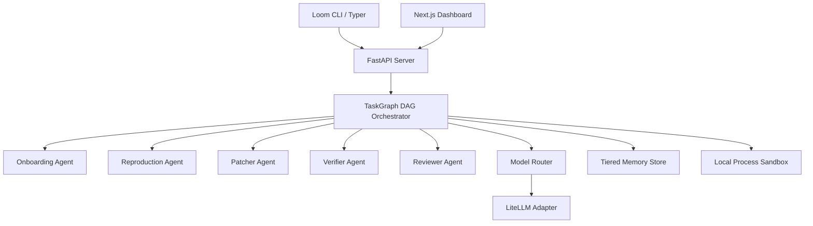

# Loom System Architecture

## System Overview

Loom is a production-grade unified agentic coding harness designed to automate software engineering workflows, code generation, bug fixing, and verification.

## Core Components

### 1. Task Graph Orchestrator (`loom/orchestrator/`)
Executes an acyclic execution graph (DAG) connecting multi-agent subtasks:
- **OnboardingAgent**: Analyzes workspace structure, build configurations, and test setups.
- **ReproductionAgent**: Formulates issue reproduction scripts and validates failure states.
- **PatcherAgent**: Proposes unified git patches to resolve target issues.
- **VerifierAgent**: Runs test suites and verification checks inside isolated sandboxes.
- **ReviewerAgent**: Performs code review and quality scoring.

### 2. Tiered Memory Store (`loom/memory/`)
Provides a 7-tier persistent memory abstraction:
- Supports SQLite (local CLI mode) and PostgreSQL (via SQLAlchemy when `DATABASE_URL` is set).
- Includes live online backups, scope indexing, and file modification invalidation.

### 3. Model Router & Adapters (`loom/adapters/`)
Translates structured agent requests into provider-specific LLM completions via LiteLLM:
- Enforces strict exception propagation in production mode (`mock=False`).
- Calculates token usage and USD cost tracking per execution node.

### 4. Sandbox Execution Environment (`loom/sandbox/`)
Provides process isolation, snapshot creation, and rollback capabilities for codebase state management.
